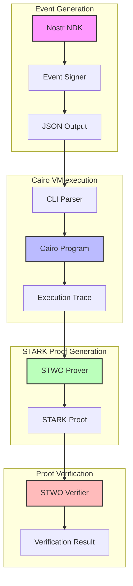
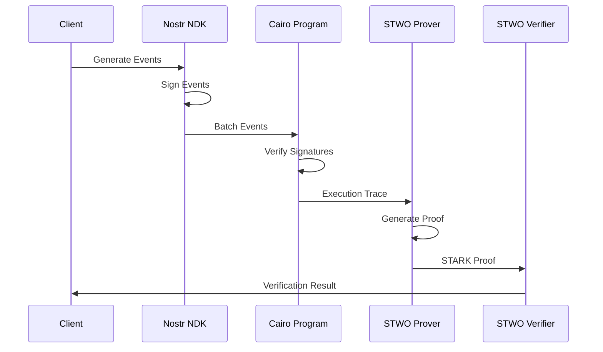

# STARKstr 🌟

> Exploring STARK proofs for enhancing Nostr's privacy, scalability, and functionality.

STARKstr is a research project exploring the potential benefits of STARK proofs for the Nostr ecosystem. It serves as a collection of proof of concepts and explorations in this direction.

## 🎯 Current Focus: Delegated Aggregate Signature Verification

Our first exploration focuses on enabling relays to strip signatures from events and provide STARK proofs that those signatures were valid. This approach offers several benefits:

- **Reduced Bandwidth**: Events can be transmitted and archived without signatures
- **Batch Verification**: Authenticity of multiple events can be verified with a single proof
- **Trust Minimization**: Clients can verify one proof instead of trusting the relay or validating a lot of signatures

This work is related to [NIP PR #1682](https://github.com/nostr-protocol/nips/pull/1682), which proposes a standard for delegated signature verification.

## 🔄 Architecture & Proving Pipeline

STARKstr implements a complete proving pipeline for Nostr event signature verification. The system is designed to be modular and extensible, leveraging the power of STARKs to provide cryptographic guarantees.

### System Architecture

### Proving Pipeline Flow

### Components

1. **Nostr Event Generation**

   - Uses [Nostr SDK](https://github.com/jeffthibault/python-nostr) for event creation
   - Generates and signs events with Schnorr signatures
   - Outputs events in JSON format
   - Extends and encodes event data into Cairo program arguments

2. **Batch Signature Verification**

   - Implements verification of multiple Schnorr signatures in Cairo
   - Uses [Cairo VM](https://github.com/lambdaclass/cairo-vm) for execution
   - Generates execution trace for proving

3. **STARK Proof Generation**

   - Uses [STWO Prover](https://github.com/starkware-libs/stwo) for proof generation
   - Leverages [STWO Cairo AIR](https://github.com/starkware-libs/stwo-cairo/) for Cairo program proving
   - Produces a STARK proof of the integrity of the computation (in this case, the verification of the signatures)

4. **Proof Verification**
   - STWO verifier for proof validation
   - Can be run in browsers, Nostr clients, or any environment
   - Provides cryptographic guarantees of signature validity of a batch of Nostr events

## 🚀 Getting Started

Check out [aggsig_checker](packages/aggsig_checker/README.md) docs for the step-by-step usage guide.

## 📊 Benchmarks

> Coming soon: We will be adding comprehensive benchmarks to evaluate:
>
> - Proof generation time
> - Verification time
> - Memory usage
> - Network overhead
> - Cloud costs

## 🛣️ Roadmap

1. **Phase 1: Proof of Concept**

   - ✅ Basic Schnorr signature verification in Cairo
   - ✅ Test data generation
   - ✅ Batch verification
   - ✅ STARK proof generation

2. **Phase 2: Benchmarking** (Current)

   - 🔄 Proof generation time depending on the number of events
   - Proof verification time vs total time of signature verification
   - Proof size vs total size of signatures

3. **Phase 3: Integration**

   - Relay implementation
   - Client libraries
   - Documentation

## 🤝 Contributing

We welcome contributions! Please check our [Contributing Guidelines](CONTRIBUTING.md) for details on how to submit pull requests, report issues, and contribute to the project.

## 📜 License

This project is licensed under the MIT License - see the [LICENSE](LICENSE) file for details.

## 🙏 Acknowledgments

- [Nostr Protocol](https://github.com/nostr-protocol/nostr)
- [StarkWare](https://starkware.co/) for Cairo and STARK technology
- [Alexandria](https://github.com/keep-starknet-strange/alexandria) for Cairo utilities

---

  Made with ❤️ by the Nostr community

