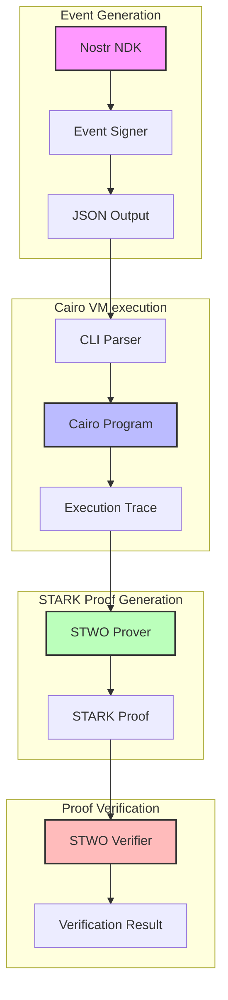
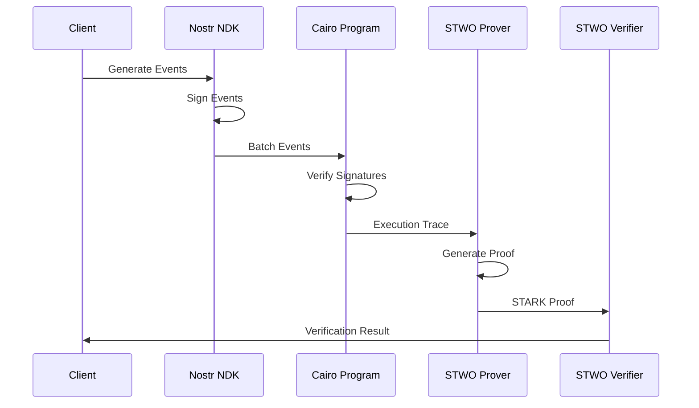

<div align="center">

<a href="https://github.com/keep-starknet-strange/starkstr/actions/workflows/e2e.yml"></a>
<a href="https://nostr.org/"> </a>
<a href="https://bitcoin.org/"> </a>
<a href="https://eprint.iacr.org/2018/046.pdf"> </a>

</div>

# STARKstr 🌟

> Exploring STARK proofs for enhancing Nostr's privacy, scalability, and functionality.

STARKstr is a research project exploring the potential benefits of STARK proofs for the Nostr ecosystem. It serves as a collection of proof of concepts and explorations in this direction.

## 🎯 Current Focus: Delegated Aggregate Signature Verification

Our first exploration focuses on enabling relays to strip signatures from events and provide STARK proofs that those signatures were valid. This approach offers several benefits:

- **Enhanced Privacy**: Signatures are not revealed, providing deniability
- **Reduced Bandwidth**: Events can be transmitted without signatures
- **Batch Verification**: Multiple signatures can be verified in a single proof
- **Trust Minimization**: Clients can verify the proof instead of trusting the relay

This work is related to [NIP PR #1682](https://github.com/nostr-protocol/nips/pull/1682), which proposes a standard for delegated signature verification.

## 🔄 Architecture & Proving Pipeline

STARKstr implements a complete proving pipeline for Nostr event signature verification. The system is designed to be modular and extensible, leveraging the power of STARKs to provide cryptographic guarantees.

### System Architecture



### Proving Pipeline Flow



### Components

1. **Event Generation** (`aggsig_checker_cli`)

   - Uses [Nostr NDK](https://github.com/nostr-dev-kit/ndk) for event creation
   - Generates and signs events with Schnorr signatures
   - Outputs events in JSON format with Cairo-compatible parameters

2. **Cairo Verification** (`aggsig_checker`)

   - Implements batch signature verification in Cairo
   - Uses [Cairo VM](https://github.com/lambdaclass/cairo-vm) for execution
   - Generates execution trace for proving

3. **STARK Proof Generation**

   - Uses [STWO Prover](https://github.com/starkware-libs/stwo) for proof generation
   - Leverages [STWO Cairo AIR](https://github.com/starkware-libs/stwo-cairo/) for Cairo program proving
   - Produces a STARK proof of the integrity of the computation (in this case, the verification of the signatures)

4. **Proof Verification**
   - STWO verifier for proof validation
   - Can be run in browsers, Nostr clients, or any environment
   - Provides cryptographic guarantees of signature validity of a batch of Nostr events

### End-to-End Flow

1. **Event Generation**:

   ```bash
   cd apps/aggsig_checker_cli
   npm start
   ```

   Generates a batch of signed Nostr events with Cairo-compatible parameters.

2. **Signature Verification**:

   ```bash
   cd packages/aggsig_checker
   make execute
   ```

   Verifies all signatures and generates execution trace.

3. **Proof Generation**:

   ```bash
   # in packages/aggsig_checker
   make prove
   ```

   Generates STARK proof from execution trace.

4. **Proof Verification**:

   ```bash
   # Coming soon: STWO verifier integration
   ```

   Verifies the STARK proof.

## 🏗️ Architecture

The project is structured into several components:

```
starkstr/
├── packages/                # Core packages
│   └── aggsig_checker/     # Cairo package for signature verification
│       ├── src/            # Cairo source code
│       └── Scarb.toml      # Package manifest
├── apps/                   # Applications
│   └── aggsig_checker_cli/ # CLI tool for signature verification
│       ├── src/            # TypeScript source code
│       └── package.json    # Package manifest
├── scripts/                # Helper scripts
│   └── verify_nostr_event_batch_signatures.sh  # Batch verification script
└── tests/                  # Test suite
```

### Components

1. **aggsig_checker** (Cairo Package)

   - Core signature verification logic
   - Schnorr signature verification using BIP340
   - Batch verification support
   - STARK proof generation (coming soon)

2. **aggsig_checker_cli** (TypeScript)
   - Command-line interface for signature verification
   - Generates sample Nostr events
   - Signs events using Schnorr signatures
   - Outputs events in JSON format
   - Converts hex values to Cairo-compatible format

## 🚀 Getting Started

### Prerequisites

- [Scarb](https://docs.swmansion.com/scarb/download.html) - Cairo package manager
- [Node.js](https://nodejs.org/) (v16 or later)

### Installation

1. Clone the repository:

   ```bash
   git clone https://github.com/keep-starknet-strange/starkstr.git
   cd starkstr
   ```

2. Install CLI dependencies:

   ```bash
   cd apps/aggsig_checker_cli
   npm install
   cd ../..
   ```

3. Install Scarb toolchain and Stwo prover

   Make sure you have nightly Rust and no previous Scarb installation.

   ```bash
   cd packages/aggsig_checker
   make install
   ```

4. Build the Cairo package:
   ```bash
   scarb build
   cd ../..
   ```

### Usage

1. Generate and verify a batch of Nostr events:

   ```bash
   ./scripts/verify_nostr_event_batch_signatures.sh
   ```

2. Run the CLI tool directly:
   ```bash
   cd apps/aggsig_checker_cli
   npm start
   ```

## 🧪 Testing

Run the test suite:

```bash
cd packages/aggsig_checker
scarb test
```

## 📊 Benchmarks

> Coming soon: We will be adding comprehensive benchmarks to evaluate:
>
> - Proof generation time
> - Verification time
> - Cloud costs
> - Memory usage
> - Network overhead

## 🛣️ Roadmap

1. **Phase 1: Proof of Concept** (Current)

   - ✅ Basic Schnorr signature verification in Cairo
   - ✅ Test data generation
   - ✅ Batch verification
   - 🔄 STARK proof generation

2. **Phase 2: Benchmarking**

   - Cloud cost analysis
   - Latency measurements
   - Scalability testing

3. **Phase 3: Integration**
   - Relay implementation
   - Client libraries
   - Documentation

## 🤝 Contributing

We welcome contributions! Please check our [Contributing Guidelines](CONTRIBUTING.md) for details on how to submit pull requests, report issues, and contribute to the project.

## 📜 License

This project is licensed under the MIT License - see the [LICENSE](LICENSE) file for details.

## 🙏 Acknowledgments

- [Nostr Protocol](https://github.com/nostr-protocol/nostr)
- [StarkWare](https://starkware.co/) for Cairo and STARK technology
- [Alexandria](https://github.com/keep-starknet-strange/alexandria) for Cairo utilities

---

<p align="center">
  Made with ❤️ by the Nostr community
</p>
